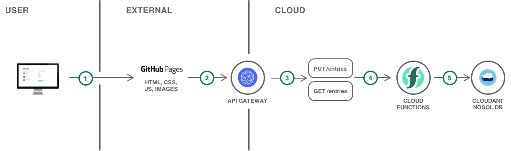
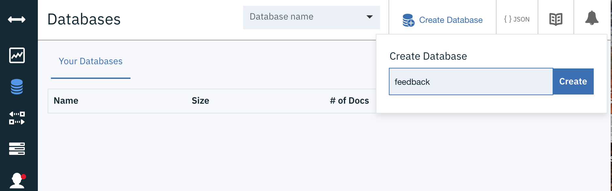
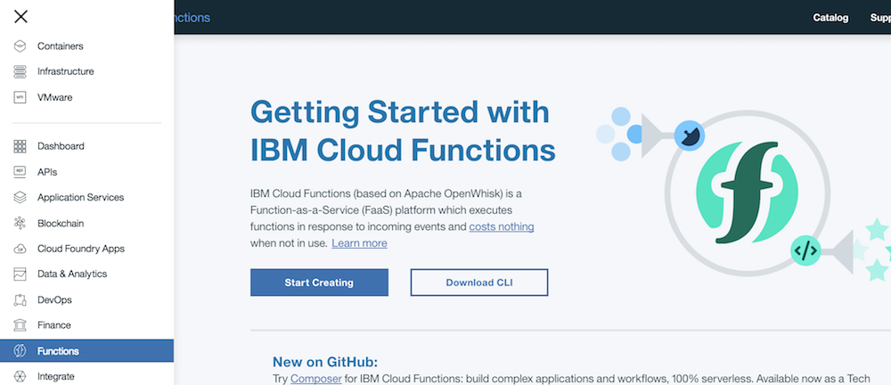
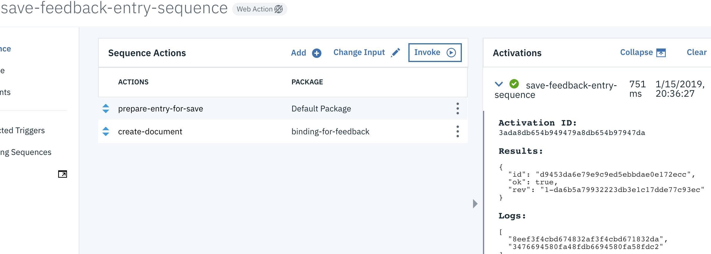
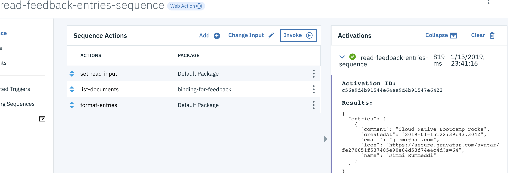
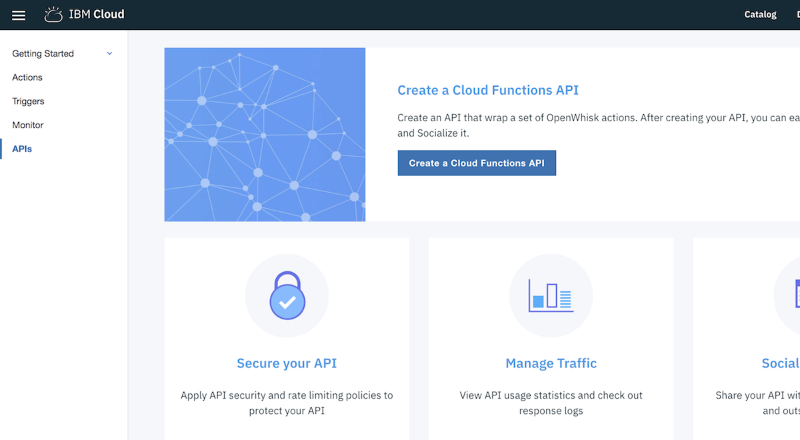
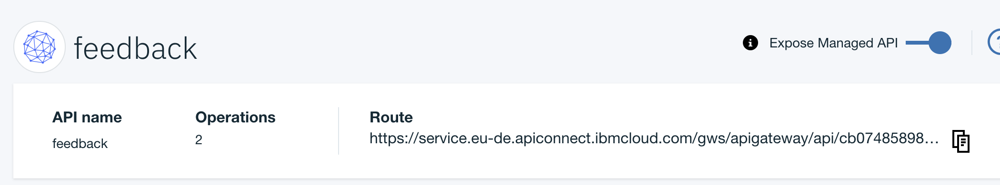
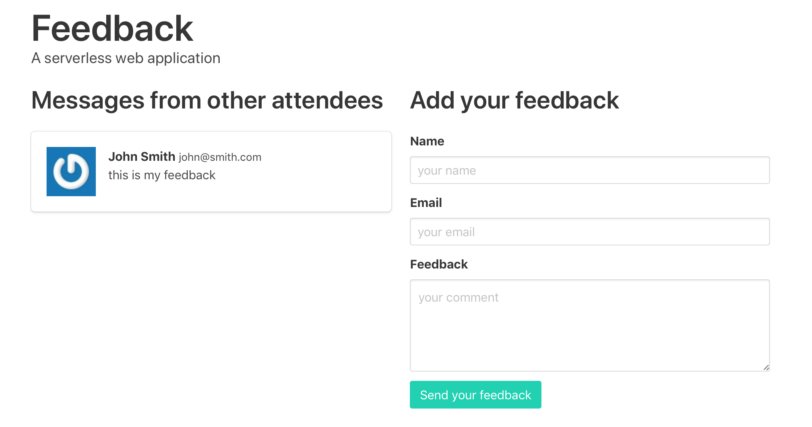

# Serverless web application and API

- [Serverless web application and API](#serverless-web-application-and-api)
  - [Objectives](#objectives)
  - [Services used](#services-used)
  - [Architecture](#architecture)
  - [Before you begin](#before-you-begin)
  - [Create the feedback database](#create-the-feedback-database)
  - [Create serverless actions](#create-serverless-actions)
    - [Sequence of actions to save the feedback](#sequence-of-actions-to-save-the-feedback)
    - [Sequence of actions to retrieve entries](#sequence-of-actions-to-retrieve-entries)
  - [Create an API](#create-an-api)
  - [Deploy the web app](#deploy-the-web-app)
  - [Remove resources](#remove-resources)
  - [Related content](#related-content)

In this tutorial, you will create a serverless web application by hosting static website content on GitHub Pages and implementing the application backend using IBM® Cloud Functions.

As an event-driven platform, Cloud Functions supports a [variety of use cases](https://console.bluemix.net/docs/openwhisk/openwhisk_use_cases.html#openwhisk_common_use_cases). Building web applications and APIs is one of them. With web apps, events are the interactions between the web browsers (or REST clients) and your web app, the HTTP requests. Instead of provisioning a virtual machine, a container or a Cloud Foundry runtime to deploy your backend, you can implement your backend API with a serverless platform. This can be a good solution to avoid paying for idle time and to let the platform scale as needed.

Any action (or function) in Cloud Functions can be turned into a HTTP endpoint ready to be consumed by web clients. When enabled for web, these actions are called *web actions*. Once you have web actions, you can assemble them into a full-featured API with API Gateway. API Gateway is a component of Cloud Functions to expose APIs. It comes with security, OAuth support, rate limiting, custom domain support.
  
## Objectives

* Deploy a serverless backend and a database
* Expose a REST API
* Host a static website
* Optional: Use a custom domain for the REST API

## Services used

This tutorial uses the following runtimes and services:

* [IBM Cloudant](https://console.bluemix.net/catalog/services/cloudantNoSQLDB)
* [Cloud Functions](https://console.bluemix.net/openwhisk)

## Architecture

The application shown in this tutorial is a simple feedback website where users can give feedback.

<p style="text-align: center;">

   
</p>

1. The user access the application hosted in GitHub Pages.
2. The web application calls a backend API.
3. The backend API is defined in API Gateway.
4. API Gateway forwards the request to [Cloud Functions](https://console.bluemix.net/openwhisk).
5. The Cloud Functions actions use [IBM Cloudant](https://console.bluemix.net/catalog/services/cloudantNoSQLDB) to store and retrieve feedback.

## Before you begin

This guide uses GitHub Pages to host the static website. Make sure you have a public GitHub account.
You will be working on Bluemix public using your own trial account. 
Log in to IBM Cloud [bluemix.net](https://bluemix.net) using your credentials and select your own trial account and then proceed as instructed below.

## Create the feedback database

**NB** This step is already completed for you in `lab-cnb` space

Let's start by creating a IBM Cloudant. IBM Cloudant is a fully managed data layer designed for modern web and mobile applications that leverages a flexible JSON schema. IBM Cloudant is built upon and compatible with Apache CouchDB and accessible through a secure HTTPS API, which scales as your application grows.

6. In the Catalog under Databases, select **Cloudant**.
7. Set the service name to **feedback-db**, select **Use both legacy credentials and IAM** as authentication methods and click **Create**.
8. Click **Launch Cloudant Dashboard** to open the Cloudant service dashboard.
9. Create a database named **feedback**.
   
10. Connect to SSH gateway and run the following commands: 
   
   Install cloud functions plugin if it is not installed yet:

   ```sh
   $ ibmcloud plugin install cloud-functions
   ```

   ```sh
   $ ibmcloud login --sso -a api.eu-gb.bluemix.net
   ```
   
   Please follow URL in command line to log in and get pass code and select **your own** account when prompted
   Then set the target to be your organization and  a space in it wit below command replacing the values between the <>
   
   ```sh
   $ ibmcloud target -o <YOUR EMAIL> -s <YOUR SPACE>
   ```
   
   You should now be logged into your own account and can run below to see the Database we added before.
   
   ```sh 
   $ ibmcloud resource service-instances
   Retrieving all instances of all services in resource group default and all locations under account xxx Account as xxx@ibm.com...
   OK
   Name          Location   State    Type   
   feedback-db   eu-gb      active   service_instance
   ```
   Now let us create an alias we can use to bind the actions we will create shortly
   
   ```sh
    $ ibmcloud resource service-alias-create feedback-db-alias --instance-name feedback-db
    Creating alias feedback-db-alias of service instance feedback-db from resource group Default into space dev...
    OK
    Service alias feedback-db-alias was successfully created.
                          
    ID:                 crn:v1:bluemix:public:cloudantnosqldb:eu-gb:a/32d493f358bb495ca17f647a8f1636bb:81ad0507-edc6-4ef9-a63d-6d0ca7793f5e:resource-alias:da831089-120d-470d-b102-e64a49bc8999   
    Name:               feedback-db-alias   
    State               active   
    Service Instance:   feedback-db   
    Space:              dev   
    Tags:                  
   ```
   
   Now let us return to the Webbrowser where you should now see a connection in the dashboard (if not refresh)
   
11. Go the dashboard and click the `feedback-db-alias` service in the *Cloud Foundry Services* section (note: NOT the services section, scroll further down)

* Under **Service Credentials**, click **New credential** 
* Name new credentials `serverless-function-credentials`
* Click **Add** leaving other values unchanged.


## Create serverless actions

In this section, you will create serverless actions (commonly termed as Functions). Functions ((based on Apache OpenWhisk) is a Function-as-a-Service (FaaS) platform which executes functions in response to incoming events and costs nothing when not in use.



**NB** if you use `lab-cnb` space of `gbscad@uk.ibm.com` organisation in Cloudfoundry that is shared by other class participants, you should replace all occurrences of `XX-` prefix in lab instructions with the number corresponding to your `demouser-XX` username assigned for the class. Those who use personal Cloudfoundry accounts may use `XX-` prefixes or may remove them completely.

### Sequence of actions to save the feedback

You will create a **sequence** which is a chain of actions where output of one action acts as an input to the following action and so on. The first sequence you will create is used to persist a guest message. Provided a name, an emailID and a comment, the sequence will:
   * Create a document to be persisted.
   * Store the document in the IBM Cloudant database.

Start by creating the first action:

1.  Activate the left pane and click **Functions** or click [https://cloud.ibm.com/functions/](https://cloud.ibm.com/functions/)
2.  In top right corner select `gbscad@uk.ibm.com_lab-cnb` London(CF-based) namespace
3.  On the left pane, click on **Actions** and then **Create**.
4.  Click **Create Action** and name it `XX-prepare-entry-for-save` and select **Node.js 10** as the Runtime.
5.  Replace the existing code with the code snippet below:
   ```js
   /**
    * Prepare the feedback entry to be persisted
    */
   function main(params) {
     if (!params.name || !params.comment) {
       return Promise.reject({ error: 'no name or comment'});
     }

     return {
       doc: {
         createdAt: new Date(),
          name: params.name,
          email: params.email,
          comment: params.comment
       }
     };
   }
   ```

16. **Save**

Then add the action to a sequence:

17. Click on **Enclosing Sequences** (left pane) and then **Add To Sequence**.
18. For the sequence name, enter `XX-save-feedback-entries-sequence` and then click **Create and Add**.

Finally add a second action to the sequence:

1.  Click on `XX-save-feedback-entries-sequence` and then click **Add**.
2.  Select **Use Public**, **Cloudant** and then choose `create-document` under **Actions**
3.  Create **New Binding** and set name to `XX-lab-feedback-db-package`.
4.  Select the `feedback-db-alias` IBM Cloudant instance and the **feedback** database and **Add** and then **Save**.
   If the `feedback-db-alias` instance does not show up, make sure to refresh the page (Shift or Cmd + Refresh) so that existing bindings are reloaded. You can also check on the command line with `ibmcloud cloud-functions package list`.

23. To test it, click on **Change Input** and enter the JSON structured as below with your values: 
    ```json
    {
      "name": "Jimmi Rummeddi",
      "email": "jimmi@hal.com",
      "comment": "Cloud Native Bootcamp rocks"
    }
    ```

24. **Apply** and then **Invoke**.
    

### Sequence of actions to retrieve entries

The second sequence is used to retrieve the existing guestbook entries. This sequence will:
   * List all documents from the database.
   * Format the documents and returning them.

25. Under **Functions**, **Create** a new action (runtime node js 8)and name it `XX-set-read-input`.
26. Replace the existing code with the code snippet below. This action passes the appropriate parameters to the next action.
   ```js
   function main(params) {
     return {
       params: {
         include_docs: true
       }
     };
   }
   ```

27. **Save**

Add the action to a sequence:

28. Click on **Enclosing Sequences**, **Add to Sequence** and **Create New**
29. Enter `XX-read-feedback-entry-sequence` for the **Action Name** and click **Create and Add**.

Complete the sequence:

30. Click on `XX-read-feedback-entry-sequence` sequence and then click **Add** to create and add the second action to get documents from Cloudant.
31. Under **Use Public**, choose **IBM Cloudant** and then `list-documents`
32. Choose `XX-lab-feedback-db-package` and **Add** to create and add this public action to your sequence.
33. Click **Add** again to create and add the third action which will format the documents from IBM Cloudant.
34. Under **Create New** enter `XX-format-entries` for name and in runtime select node.js 8 and then click **Create and Add**.
35. Click on `XX-format-entries` and replace the code with below:
   ```js
   const md5 = require('spark-md5');

   function main(params) {
     return {
       entries: params.rows.map((row) => { return {
         name: row.doc.name,
         email: row.doc.email,
         comment: row.doc.comment,
         createdAt: row.doc.createdAt,
         icon: (row.doc.email ? `https://secure.gravatar.com/avatar/${md5.hash(row.doc.email.trim().toLowerCase())}?s=64` : null)
       }})
     };
   }
   ```

36. **Save**
37. Choose the sequence by clicking on **Actions** in the upper left corner of your browser and then `XX-read-feedback-entry-sequence`.
38. Click on **Save** and then **Invoke**. The output should look like the following:
   

## Create an API



39. Go to Dashboard, Functions and Actions or click here https://console.bluemix.net/openwhisk/actions.
40. Select the `XX-read-feedback-entry-sequence` sequence. Click **Endpoints** in the left pane and set a checkmark in  **Enable as Web Action** and click **Save**.
41. Do the same for the `XX-save-feedback-entries-sequence` sequence.
42. Go to Dashboard, Functions and Actions and APIs or click here https://console.bluemix.net/openwhisk/apimanagement and **Create a Cloud Functions API**
43. Set name to `XX-feedback` and base path to `/XX-feedback`
44. Create an operation to retrieve feedback entries:
  * Set **path** to **/entries**
  * Set **verb** to **GET**
  * Select the action `XX-read-feedback-entry-sequence` action and press Create
45. Create an operation to persist a feedback entry:
  * Set **path** to **/entries**
  * Set **verb** to **PUT**
  * Select the action `XX-save-feedback-entries-sequence` action and press create
46. Press Save and the API will be default exposed as seen below. Note the route as we will need that shortly.



## Deploy the web app

47. Fork the feedback user interface repository https://github.com/grigorijk/serverless-feedback to your public GitHub.
48. Modify **docs/feedback.js** and replace the value of **apiUrl** with the route given by API Gateway.
49. Commit the modified file to your forked repository.
50. In the Settings page of your repository, scroll to **GitHub Pages**, change the source to **master branch /docs folder** and Save.
51. Access the public page for your repository.
52. You should see the "test" feedback entry created earlier.
53. Add new entries.



<!-- ## Deploy Cloud Functions using the delivery pipeline

54. Fork the labs repository [https://github.com/grigorijk/cloudappdev-serverless-lab](https://github.com/grigorijk/cloudappdev-serverless-lab) to your public GitHub account
55. Review the forked repository:
  * `format-entries.js`, `prepare-entry-for-save.js` and `set-read-input.js` have code for the function actions
  * `pipeline/build.sh` is used to build serverless function code. In our case, this is just a placeholder since function code is simple and does not require any build actions
  * `pipeline/deploy.sh` is used to do all deployment activity: logging into IBM Cloud; creating actions, binding, sequences and APIs
  * `pipeline/create-action.sh` is used for safe creation of actions and sequences 
  * `pipeline/serverless.yml` is used to define serverless model of actions and sequences 
56. Update `pipeline/serverless.yml` changing `NN-feedback-service` line to the number of corresponding demouser(i.e. `01-feedback-service`). Commit the edited file to the repository
57. Log into IBM Cloud UI(if not logged in yet)
58. Navigate to the toolchain project [https://github.com/grigorijk/cloud-functions-toolchain](https://github.com/grigorijk/cloud-functions-toolchain) and click `Create Toolchain` button
59. Change toolchain name to `XX-labs-toolchain`
60. If using shared environment, select `London` location and legacy Cloudfoundry organisation. This might cause request to provide access to GitHub
61. Tool integrations for GitHub
   * GitHub server: github.com
   * Repository type: existing
   * Repository URL: your forked GitHub repository
   * Enable GitHub issues: false
   * Track deployment changes: true
62. Tool integrations for Delivery Pipeline
  *  App name: `XX-labs-functions`
  *  IBM Cloud API Key: provide an existing `yll77n27jKMJ6S_6K-jPBmzMQ8SUi9TTjJVbd40zY9h-` for `cloud-cnb` or click `Create` button if using your own account. Wait while the next fields are refreshed
  *  Production stage: select your personal or class organisation and space
63. Click `Create` button
64. Navigate to the created toolchain and explore its deployment status -->

## Remove resources

* Delete IBM Cloudant service (if you created any)
* Delete API from Cloud Functions
* Delete actions from Cloud Functions

## Related content
* [More guides and samples on serverless](https://developer.ibm.com/code/journey/category/serverless/)
* [Getting started with {{site.data.keyword.openwhisk}}](https://console.bluemix.net/docs/openwhisk/index.html#getting-started-with-openwhisk)
* [{{site.data.keyword.openwhisk}} common use cases](https://console.bluemix.net/docs/openwhisk/openwhisk_use_cases.html#openwhisk_common_use_cases)
* [Create APIs from actions](https://console.bluemix.net/docs/apis/management/manage_openwhisk_apis.html#manage_openwhisk_apis)
